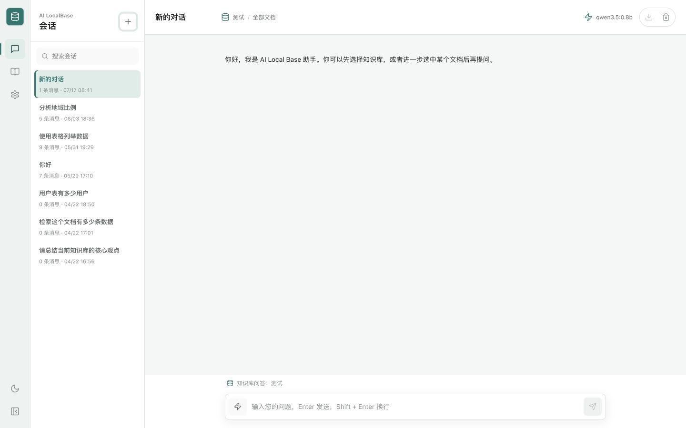
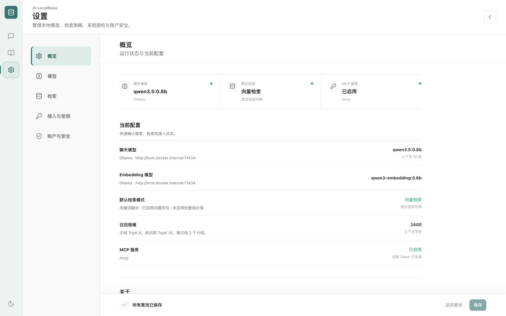
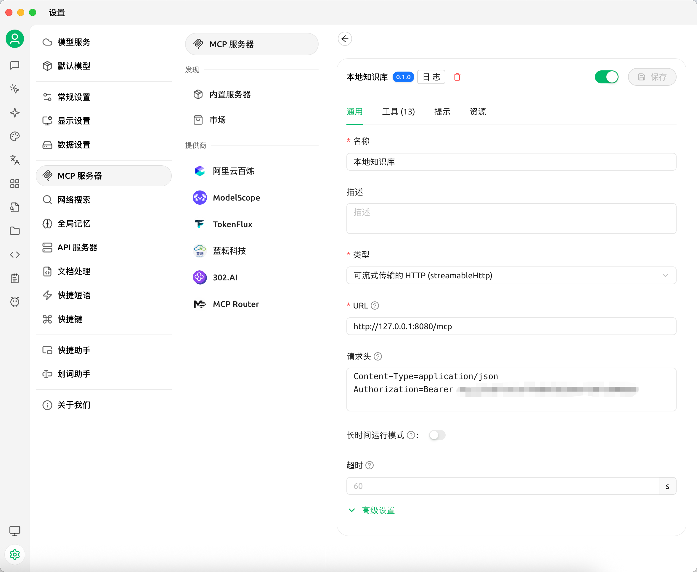
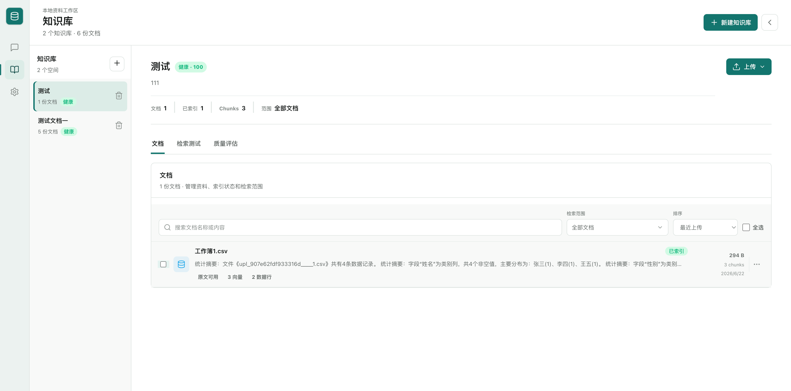
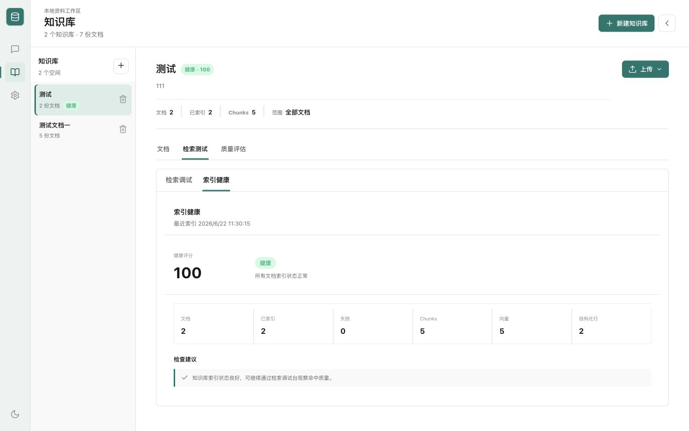
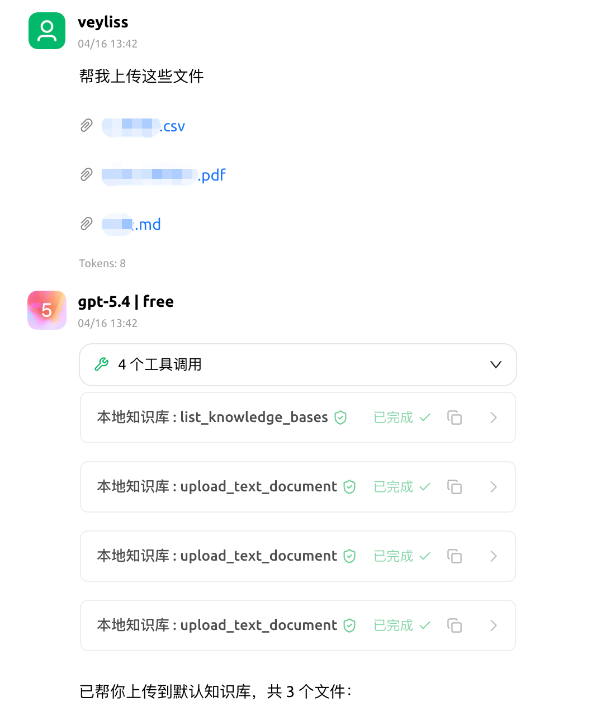
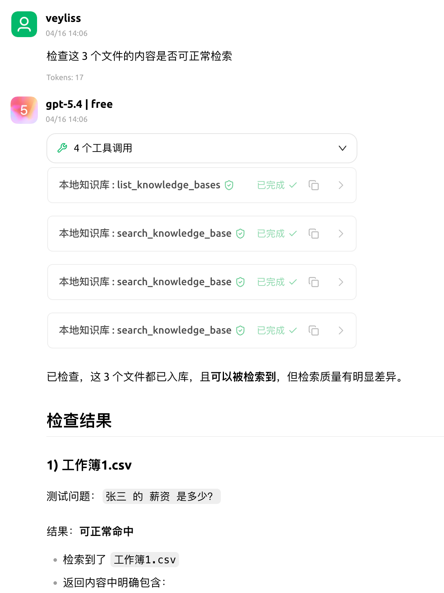

# LocalRAG

一个本地优先的 AI 知识库系统（RAG），用于将本地文档接入向量检索与大模型对话流程。项目提供 Web UI，支持知识库管理、文档上传、检索增强问答、聊天记录持久化，以及基于 Ollama 或 OpenAI 兼容接口的模型接入。



## 项目简介

LocalRAG 适合个人或小团队在本地环境、自托管环境中快速搭建可用的知识库问答系统。

- 后端：Go + Gin
- 前端：React + Vite + TypeScript
- 向量数据库：Qdrant
- 模型接入：Ollama / OpenAI Compatible API
- 部署方式：Docker Compose（推荐），本地单进程调试作为补充
- 扩展能力：内置 MCP Server，可供外部 Agent / 工具系统接入

---

## 核心能力

- 知识库管理：创建、删除知识库，查看文档列表
- 文档上传与索引：支持 TXT、Markdown、PDF、xlsx、csv 文件上传与解析
- 检索增强问答：基于 Qdrant 做向量检索并把命中内容注入对话上下文
- 聊天记录持久化：会话消息保存到本地 SQLite 数据库
- 配置持久化：模型配置与知识库状态保存到本地 JSON 文件
- Docker Compose 部署：支持一键拉起前端、后端、Qdrant

### 检索增强能力

- 文本自动切分与批量嵌入
- 候选结果动态召回
- 关键词覆盖增强重排
- MMR 去冗余选择
- 低置信度场景二次扩召回
- 嵌入缓存与可选语义缓存
- 可选 Hybrid Search、Semantic Reranker、Query Rewrite、Context Compression
- 可从现有知识库文档生成 RAG 评估数据集，用于小样本效果验证

---

## 适用场景

- 本地个人知识库
- 团队内部文档问答
- 自托管 RAG 原型验证
- Ollama / OpenAI 兼容模型接入测试
- 检索策略实验与评估
- 作为 MCP 能力后端供 Agent 调用
- 批量文档支持异步索引 Job，可查询进度并取消任务

---

## 快速开始

最短体验路径：

1. 复制环境变量模板：

```bash
cp .env.example .env
```

2. 启动全部服务：

```bash
docker compose up --build
```

3. 打开 `http://localhost:4173`，进入设置页配置 Chat 与 Embedding 模型。

如需更完整的命令、环境变量与接口说明，请查看 [`docs/getting-started.md`](docs/getting-started.md)。
中期验收材料见 [`docs/midterm-check.md`](docs/midterm-check.md)。

---

## 启动与部署

### Docker Compose 一键启动（推荐）

适合快速体验和自托管部署。

```bash
cp .env.example .env
docker compose up --build
```

常用运行配置已集中在 `.env.example`。其中 `QDRANT_VECTOR_SIZE` 必须与 Embedding 模型维度一致；如果你更换了不同维度的 Embedding 模型，需要换新的 `QDRANT_COLLECTION_PREFIX` 或重建旧集合。开启 `ENABLE_HYBRID_SEARCH` 前也建议换新前缀并重建索引，以便 Qdrant collection 使用 named dense/sparse vectors。

Docker 自托管建议设置：

- `ENABLE_AUTH=true`：开启 Web 登录与 API Key 鉴权。
- `AUTH_USERNAME=root`：默认 root 用户名。
- `AUTH_PASSWORD=<强密码>`：首次启动自动创建 root 用户。
- `AUTH_SETUP_TOKEN=<随机值>`：如果不使用 `AUTH_PASSWORD`，建议设置初始化保护 Token。
- `QDRANT_BIND_ADDRESS=127.0.0.1`：默认只允许宿主机本机访问 Qdrant 端口，避免服务器部署时暴露向量库。
- `MAX_UPLOAD_BYTES=26214400`：默认单文件上传上限为 25 MiB，可按资源情况调大。
- `NGINX_CLIENT_MAX_BODY_SIZE=32m`：Docker 前端代理请求体上限，需要高于单文件上传上限以容纳 multipart 开销。

普通和生产 Docker Compose 默认启用认证；如果 `ENABLE_AUTH=true` 且未设置 `AUTH_PASSWORD`，首次访问 Web 页面会进入初始化向导。服务器部署请优先设置 `AUTH_PASSWORD` 或 `AUTH_SETUP_TOKEN`，避免初始化窗口被他人抢占。开发 Compose 如需免登录调试，请显式设置 `ENABLE_AUTH=false`。

默认服务地址：

- 前端：`http://localhost:4173`
- 后端：`http://localhost:8080`
- Qdrant HTTP API：`http://localhost:6333`
- Qdrant gRPC：`localhost:6334`

默认情况下 Qdrant 端口只绑定在 `127.0.0.1`。如果需要让其他机器直接访问 Qdrant，请显式设置 `QDRANT_BIND_ADDRESS=0.0.0.0`，同时配置 `QDRANT_API_KEY` 与服务器防火墙；非回环地址没有 API Key 时，Qdrant 容器会拒绝启动。

生产 Compose 已配置容器自动重启、日志轮转和资源上限。后端业务进程以非 root 用户运行，首次启动会自动修正持久化数据目录的文件属主并写入迁移标记；相关资源变量见 [`DOCKER_DEPLOY.md`](DOCKER_DEPLOY.md)。如果外层还有受控 HTTPS 反向代理，请设置 `TRUST_EXTERNAL_PROXY_HEADERS=true` 并保留 `X-Forwarded-Proto` 和 `X-Forwarded-Host`；前端端口直接暴露时保持默认值 `false`。

当前应用层按**单实例**设计：本地 SQLite 聊天记录、应用状态文件和内存中的 MCP Job 不支持多个后端副本共享写入。生产 Compose 默认使用 `latest` 镜像；需要可回滚部署时通过 `LOCALRAG_IMAGE_TAG` 显式固定具体版本或 commit tag。本地源码修改请使用开发或本地构建编排验证，也不要使用 `docker compose scale backend=2`。

默认数据目录由 `.env` 控制，主要包括上传文件、应用状态、聊天 SQLite 数据库和 Qdrant 持久化目录。升级或迁移前建议先备份这些路径，详见 [`docs/backup-restore.md`](docs/backup-restore.md)。

### 使用预构建镜像部署

如果不想本地编译，可直接使用预构建镜像：

```bash
LOCALRAG_IMAGE_TAG=latest docker compose -f docker-compose.prod.yml up -d
```

生产 Compose 在未提供 `ENABLE_AUTH` 时默认开启认证；如果使用 `.env.example`，请在启动前确认 `ENABLE_AUTH=true`，并设置 `AUTH_PASSWORD` 或 `AUTH_SETUP_TOKEN`。后端默认只绑定宿主机本机，浏览器通过前端 `4173` 端口访问；如确需直接访问后端，再显式设置 `BACKEND_BIND_ADDRESS=0.0.0.0`。

更多镜像、版本与部署细节见 [`DOCKER_DEPLOY.md`](DOCKER_DEPLOY.md)。

### 仅启动应用编排

如果希望单独使用应用编排文件，也可以执行：

```bash
docker compose -f docker-compose.app.yml up --build
```

### 本地开发启动（推荐）

适合日常开发、调试接口、修改前端页面。该编排会同时启动 Qdrant、后端和前端开发服务器，并通过 volume 挂载本地代码：

```bash
cp .env.example .env
docker compose -f docker-compose.dev.yml up --build
```

默认开发地址：

- 前端：`http://localhost:4173`
- 后端：`http://localhost:8080`
- Qdrant：`http://localhost:6333`

如果需要单独运行后端、前端或测试命令，可参考 [`docs/getting-started.md`](docs/getting-started.md) 中的开发命令。

---

## 设置页面配置

### 设置页面



打开前端后，进入 Settings 页面，分别配置 Chat 与 Embedding。

### Ollama 示例

Docker Desktop（Windows）中的后端访问宿主机 Ollama 时，Base URL 使用
`http://host.docker.internal:11434`；直接在 Windows 本机运行后端时使用
`http://localhost:11434`。本项目中期演示使用的本地模型为 `qwen3.5:9b` 和
`nomic-embed-text`，其中后者输出 768 维向量。

**Chat 配置**

- Provider: `ollama`
- Base URL: `http://localhost:11434`（Docker 使用 `http://host.docker.internal:11434`）
- Model: `qwen3.5:9b`，也可以替换为本机已安装的其他 Ollama Chat 模型
- API Key: 留空

**Embedding 配置**

- Provider: `ollama`
- Base URL: `http://localhost:11434`（Docker 使用 `http://host.docker.internal:11434`）
- Model: `nomic-embed-text`
- API Key: 留空

### 模型发现与健康探测

设置页中的 Base URL 必须填写**服务根地址**，而不是具体模型 API 路径：Ollama 例如
`http://localhost:11434`；Docker Desktop（Windows）中的后端访问宿主机 Ollama 时使用
`http://host.docker.internal:11434`。OpenAI Compatible Base URL 可以填写提供商根地址，
也可以填写以 `/v1` 结尾的地址；后端会统一规范化为所需的 `/v1` 基址。

- **获取模型**：向当前 Provider 读取可用模型候选列表，不会下载模型；请先在 Ollama 或对应 Provider 中安装/提供模型。
- **探测模型**：向所选 Chat 或 Embedding 模型发送一次真实请求，并在设置页显示本次请求的 latency（毫秒）。
- **Embedding 维度**：Embedding 探测会返回实际向量维度；要成功用于索引，该维度必须与 `QDRANT_VECTOR_SIZE` 匹配。不匹配时应调整模型或 Qdrant 配置，并使用新的 `QDRANT_COLLECTION_PREFIX` 后重新索引。
- **保存行为**：探测仅检查当前表单值，不会自动保存配置；探测失败也不会自动覆盖或写入当前已保存的模型配置。确认配置后，请使用设置页的“保存”按钮。
- **Chat 与 Embedding 独立**：Embedding 不要求使用本机 Ollama，可以配置公网、公司内网或其他 OpenAI Compatible 服务。能调用 Chat 接口不代表同一服务也提供 Embedding 接口，必要时请为 Chat 和 Embedding 分别配置地址与模型。
- **Embedding 接口要求**：如果服务返回 `This server does not support embeddings. Start it with --embeddings`，请在该服务启动时启用 embeddings，或把 Embedding 配置改为支持 `/v1/embeddings`（Ollama 使用 `/api/embed`）的服务。

### OpenAI Compatible 示例

**Chat 配置**

- Provider: `openai-compatible`
- Base URL: 你的兼容接口地址，例如 `https://your-api.example.com/v1`
- Model: 对应聊天模型名
- API Key: 对应访问密钥

**Embedding 配置**

- Provider: `openai-compatible`
- Base URL: 你的兼容接口地址
- Model: 对应嵌入模型名
- API Key: 对应访问密钥

---

## MCP 支持

项目内置基础 MCP Server 能力，作为后端内嵌工具服务运行，可供外部 Agent、脚本或工具系统通过 HTTP / JSON-RPC 接入。

当前支持：

- MCP Server 版本：随应用发布版本注入，开发构建显示 `dev`
- HTTP / JSON-RPC MCP 入口（JSON 响应型 Streamable HTTP 子集）
- 支持 `initialize`、`ping`、`tools/list`、`tools/call` 与初始化通知
- 工具列表发现能力
- 只读 / 写入 / 危险工具权限分级
- API Key Scope 鉴权，旧 MCP Token 已废弃，仅保留迁移兼容开关
- 限流、超时与审计日志
- 危险工具一次性确认机制
- 复用现有知识库、会话、配置与检索服务
- MCP 能力自检工具：`get_mcp_capabilities`
- 文档详情、检索调试、结构化查询、评估集生成和重建索引工具
- MCP Job 工作流：异步导入、状态查询、取消和最近任务列表
- Agent 友好组合工具：带来源回答、知识库质量检查、检索模式对比、评测样本创建和文档摘要
- Settings 内置 Cherry Studio、Claude Desktop、Cursor / 通用 HTTP MCP 复制模板

默认入口：

- `GET /mcp`
- `GET /mcp/tools`
- `POST /mcp`

常用环境变量：

- `ENABLE_MCP`：是否启用 MCP，默认 `false`
- `ENABLE_MCP_LEGACY_TOKEN`：是否允许已废弃的旧 MCP Token 鉴权，默认 `false`
- `MCP_BASE_PATH`：MCP 挂载路径，默认 `/mcp`
- `MCP_REQUEST_TIMEOUT_SECONDS`：请求超时，默认 `15`
- `MCP_REQUESTS_PER_MINUTE`：每分钟限流，默认 `120`

MCP 面向外部 Agent 暴露本地知识库和会话能力，服务器部署时请只在 `ENABLE_AUTH=true` 后再开启。新接入推荐使用带 `mcp:*` scope 的 API Key。旧 MCP Token 等价 MCP 全权限，已废弃且默认不允许鉴权；仅迁移旧客户端时临时设置 `ENABLE_MCP_LEGACY_TOKEN=true`。

Docker 前端同源代理支持默认 `/mcp`，也支持以 `/mcp` 结尾的嵌套路径，例如 `/agent/mcp`。当前实现返回 JSON，不发放 MCP 会话 ID，也不提供 SSE 长连接；客户端应同时接受 `application/json`，不要只声明 `text/event-stream`。如果使用其他自定义路径，需要自行配置外部反向代理，或让 MCP 客户端直接访问后端端口。

### Cherry Studio 接入示例

如果你希望在 Cherry Studio 中通过 MCP 接入 [`LocalRAG`](README.md)，可以按以下方式配置：

- **类型**：HTTP JSON-RPC（客户端配置中可能显示为 `streamableHttp`）
- **URL**：`http://127.0.0.1:8080/mcp`
- **请求头**：
  - `Content-Type: application/json`
  - `Authorization: Bearer <带 MCP scope 的 API Key>`
  - `Accept: application/json, text/event-stream`
- **建议 scope**：`mcp:read`、`mcp:upload`、`mcp:eval`；需要删除类工具时再额外授予 `mcp:danger`




更完整的方法、工具列表、鉴权与调用示例见 [`docs/mcp.md`](docs/mcp.md)。

---

## 界面预览

### Demo 演示

<p align="center">
  
  
</p>
<p align="center">
  
  
</p>
---

## 文档导航

- 快速开始与使用指南：[`docs/getting-started.md`](docs/getting-started.md)
- 系统架构：[`docs/architecture.md`](docs/architecture.md)
- MCP 说明：[`docs/mcp.md`](docs/mcp.md)
- 检索优化计划：本地工作区 `plans/retrieval-improvement-plan.md`（不纳入 Git）
- Docker 镜像与部署指南：[`DOCKER_DEPLOY.md`](DOCKER_DEPLOY.md)
- 故障排查：[`TROUBLESHOOTING.md`](TROUBLESHOOTING.md)

---

## 项目结构

```text
localrag/
├── backend/
├── frontend/
├── docs/
├── docker/
├── assets/
├── docker-compose.yml
├── docker-compose.qdrant.yml
├── docker-compose.app.yml
└── docker-compose.prod.yml
```

更完整的系统结构、模块职责与接口设计见 [`docs/architecture.md`](docs/architecture.md)。

---

## 开源协作

- License：[`LICENSE`](LICENSE)
- 贡献指南：[`CONTRIBUTING.md`](CONTRIBUTING.md)
- 安全策略：[`SECURITY.md`](SECURITY.md)
- 更新记录：[`CHANGELOG.md`](CHANGELOG.md)

## Community / 社区

- Community: https://linux.do
- Discord：https://discord.gg/YzFeYC66y5

**如果这个项目对你有帮助，请给个 ⭐ Star。**

## Star History

<a href="https://www.star-history.com/?repos=youshi01%2FLocalRAG&type=date&legend=top-left">
 <picture>
   <source media="(prefers-color-scheme: dark)" srcset="https://api.star-history.com/chart?repos=youshi01/LocalRAG&type=date&theme=dark&legend=top-left" />
   <source media="(prefers-color-scheme: light)" srcset="https://api.star-history.com/chart?repos=youshi01/LocalRAG&type=date&legend=top-left" />
   
 </picture>
</a>
